<!-- PORTRAIT - generated by scripts/dotify.py from assets/jacket.png.
     Colour mode, so one file serves both GitHub themes. Regenerate with:
       python scripts/dotify.py assets/jacket.png -o assets/portrait \
         --cols 100 --equalize --detail 0.5 --color -->

 

<!-- NAME / TAGLINE - animated typing -->

 

<!-- SOCIALS -->

# Hi there, I'm Manya 👋 👩‍💻

I am a **Computer Science & AI Student at IGDTUW** with a passion for building intelligent systems and decentralized solutions. I bridge the gap between **Artificial Intelligence** and **Blockchain** to create secure, automated, and impactful technology.

🔭 Currently Exploring
Decentralized Intelligence: Architecting the intersection of LLMs and Web3 to build intent-based blockchain interactions.

On-Chain Security: Applying advanced Machine Learning models to enhance threat detection and security protocols within the EVM ecosystem.

Smart Accounts: Exploring Account Abstraction (ERC-4337) and modular wallet infrastructures to simplify user onboarding.

🛠️ Core Focus
AI/ML: Predictive Modeling, NLP, and Hybrid Optimization Algorithms.

Web3: Solidity, Smart Contract Security, and Decentralized Identity.

### ⚡ Fun Fact
When I'm not debugging smart contracts or training models, I'm likely singing or trying to beat my high score in retro arcade games like Pac-Man. 🕹️
---

## 🛠️ Tech Stack
     

## 📫 Connect with me!

 

## 🐍 Contribution Snake

